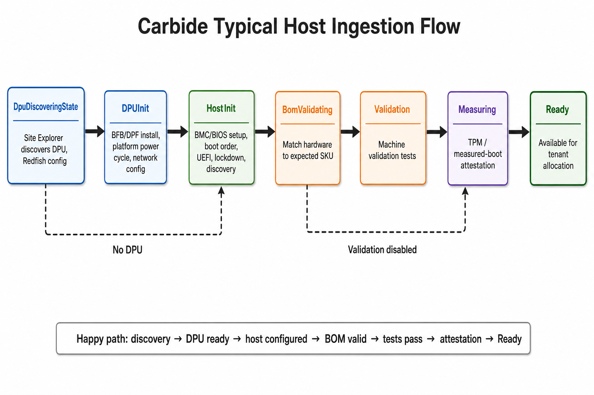

# Host Ingestion Failures

Use this playbook when a host does not enter the managed pool after being added
to a site.

## Ingestion Flow



## Quick Checks

1. Confirm the host is listed in expected machines.
2. Confirm the host BMC is reachable over the out-of-band network.
3. Confirm BMC credentials are available through Vault.
4. Check Site Explorer output.
5. Check DHCP and PXE/HTTP boot logs.
6. Check `nico-scout` logs on the host.
7. Check validation and SKU validation results.

## Expected Machine

Confirm the host exists in NICo inventory or expected-machine state.

```bash
nico-admin-cli expected-machine show
nico-admin-cli managed-host show --all
```

If the host is missing, fix the expected-machine source before debugging host
boot or discovery.

## BMC and Redfish

NICo cannot ingest a host if it cannot reach the BMC.

Check:

- BMC IP is reachable from the site controller.
- BMC credentials are present and valid.
- Vault access from `nico-api` is healthy.
- Site Explorer can scrape the endpoint.

```bash
nico-admin-cli site-explorer get-report all
nico-admin-cli redfish browse --address <bmc-ip> /redfish/v1
```

Look in `nico-api` logs for:

- Redfish client creation errors
- missing credentials
- HTTP 401 or 403
- TLS failures
- timeout or route failures

## DHCP and PXE

Host discovery depends on DHCP and PXE/HTTP boot.

Check:

```bash
kubectl -n <nico-namespace> logs deploy/nico-dhcp --tail=500 | grep <mac-or-machine-id>
kubectl -n <nico-namespace> logs deploy/nico-pxe --tail=500 | grep <mac-or-machine-id>
```

Common signs:

| Symptom | Likely issue |
|---|---|
| No DHCP request | relay, cabling, VLAN, or host not booting from the expected NIC. |
| DHCP request but no lease | IP pool exhausted or MAC not in expected state. |
| Lease assigned but no PXE request | boot order or next-server path. |
| PXE request succeeds but host never reports | discovery image boot or `nico-scout` failure. |

## Scout Logs

When the discovery image boots, `nico-scout` reports host details back to NICo.

On the host:

```bash
cat /var/log/nico/nico-scout.log
```

Look for:

- API reachability failures
- TLS or root CA problems
- hardware enumeration failures
- NIC or DPU pairing problems
- SKU or validation input mismatch

## Validation and SKU

After discovery, ingestion may block on validation.

```bash
nico-admin-cli machine-validation results show --machine <host-machine-id>
nico-admin-cli machine-validation runs show --machine <host-machine-id>
nico-admin-cli sku verify <host-machine-id>
nico-admin-cli machine health-report show <host-machine-id>
```

If validation failed, avoid force deleting the host until the failed test and
hardware expectation are understood.

## Recovery

| Root cause | Recovery |
|---|---|
| Incorrect expected-machine entry | Correct source data and restart discovery. |
| BMC unreachable | Fix OOB network, BMC power, credentials, or Vault. |
| DHCP/PXE broken | Fix relay, IP pool, boot order, or PXE service. |
| Scout cannot reach API | Fix routing, TLS, proxy, or API availability. |
| Validation failed | Fix hardware or SKU expectation, then rerun validation. |

Avoid deleting and retrying unless the object has not been created on the site
or the lifecycle owner confirms it is safe.
