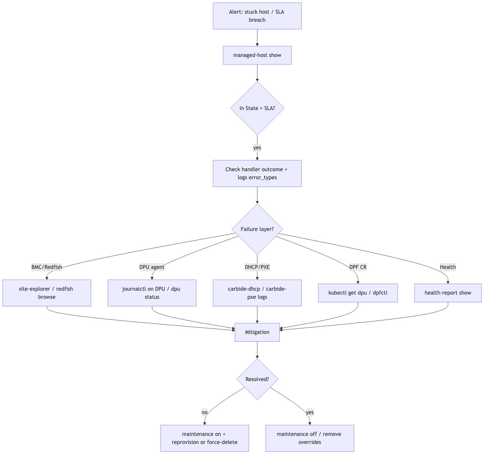

# State Machine Debugging

Use this playbook when a managed host, DPU, network segment, InfiniBand
partition, NVLink partition, or instance is not advancing through its lifecycle.

Start by finding the exact site-side state. The cloud UI often shows a simplified
state such as `Provisioning`, `Ready`, or `Deleting`. NICo tracks more detailed
site-side states such as `Host/WaitingForDiscovery` or
`Assigned/BootingWithDiscoveryImage`.

## Quick Triage

1. Confirm whether the cloud state and the site state agree.
2. Identify the exact state and how long the object has been there.
3. Check whether the object is past its state SLA.
4. Look for the last state handler error or wait reason.
5. Check health reports and active overrides.
6. Choose a mitigation based on the blocking dependency.

## Inspect Managed Hosts

List managed hosts and look for long-lived transient states:

```bash
nico-admin-cli managed-host show --all
```

Inspect one host:

```bash
nico-admin-cli managed-host show <host-machine-id>
```

Fetch event history in JSON:

```bash
nico-admin-cli -f json machine show <machine-id>
```

Useful fields:

| Field | What to look for |
|---|---|
| `state` | Exact lifecycle state and substate. |
| `time_in_state` | Whether the object has been stuck long enough to page. |
| `time_in_state_above_sla` | Explicit SLA breach flag. |
| `reason` | Handler wait reason or recent failure detail. |
| `events` | Recent state transitions and timestamps. |

## Metrics and Dashboards

Use Grafana to understand whether this is one object or a fleet-wide issue.

| Metric | Use |
|---|---|
| `carbide_machines_per_state` | Count hosts by state. Transient states should not accumulate. |
| `carbide_machines_time_in_state_seconds` | Average dwell time by state. |
| `carbide_machines_per_state_above_sla` | Hosts past SLA in a state. |
| `carbide_machines_with_state_handling_errors_per_state` | Handler errors grouped by state. |
| `carbide_network_segments_per_state_above_sla` | Network segment lifecycle stalls. |
| `carbide_ib_partitions_per_state_above_sla` | InfiniBand lifecycle stalls. |

## Logs

State-controller iterations are logged by `nico-api`. Filter by machine ID and
state-handler errors.

```bash
kubectl -n <nico-namespace> logs deploy/nico-api --tail=500 | grep <machine-id>
```

Look for:

- `State handler error`
- Redfish connectivity failures
- Vault or credential lookup failures
- DPU network status wait reasons
- validation failures
- reboot or power action failures

See [Diagnostic Tools](./diagnostic_tools.md) for log locations and Loki
queries.

## Health and Allocation Blockers

Check health before forcing a state transition. Many state handlers intentionally
wait when health reports indicate a blocking condition.

```bash
nico-admin-cli machine health-report show <machine-id>
```

Health classifications determine operational impact:

- `PreventAllocations` blocks new allocations.
- `ExcludeFromStateMachineSla` keeps long-running investigation work from
  counting against state-machine SLA.
- workflow-specific templates may intentionally hold a host out of service.

See [Health Alerts and Overrides](./health_alerts.md).

## Operational Controls

Use non-destructive controls first.

| Need | Command |
|---|---|
| Suppress SLA pages while investigating | `nico-admin-cli managed-host maintenance on --host <host-machine-id> --reference "INC-123 investigating"` |
| Remove maintenance mode | `nico-admin-cli managed-host maintenance off --host <host-machine-id>` |
| Hold a host out of allocation | `nico-admin-cli machine health-override add <machine-id> --template out-for-repair --message "INC-123"` |
| Clear a temporary override | `nico-admin-cli machine health-override remove <machine-id> <source-name>` |
| Collect a debug bundle | `nico-admin-cli managed-host debug-bundle <machine-id> --start-time <time> --grafana-url <url>` |

## Reprovisioning

Queue DPU reprovisioning:

```bash
nico-admin-cli dpu reprovision set \
  --id <dpu-or-host-machine-id> \
  --update-message "<maintenance-reference>"
nico-admin-cli dpu reprovision list
```

Restart an in-progress DPU reprovision:

```bash
nico-admin-cli dpu reprovision restart --id <host-machine-id>
```

Clear a DPU reprovision flag:

```bash
nico-admin-cli dpu reprovision clear --id <machine-id>
```

Queue host reprovisioning:

```bash
nico-admin-cli host reprovision set \
  --id <host-machine-id> \
  --update-message "<maintenance-reference>"
nico-admin-cli host reprovision list
```

Clear host reprovisioning:

```bash
nico-admin-cli host reprovision clear --id <host-machine-id>
```

Mark a manual firmware step complete:

```bash
nico-admin-cli host reprovision mark-manual-upgrade-complete --id <host-machine-id>
```

## Destructive Recovery

Only use destructive reset after the blocking dependency is understood and the
tenant or operator impact is acceptable.

```bash
nico-admin-cli machine force-delete --machine <machine-id>
```

After a force delete, reboot the host through BMC or Redfish so discovery can
restart.

## Workflow



## Related Playbooks

- [Diagnostic Tools](./diagnostic_tools.md)
- [DPU Provisioning Failures](./dpu_provisioning_failures.md)
- [Host Ingestion Failures](./host_ingestion_failures.md)
- [Network Connectivity Issues](./network_connectivity.md)
- [Health Alerts and Overrides](./health_alerts.md)
