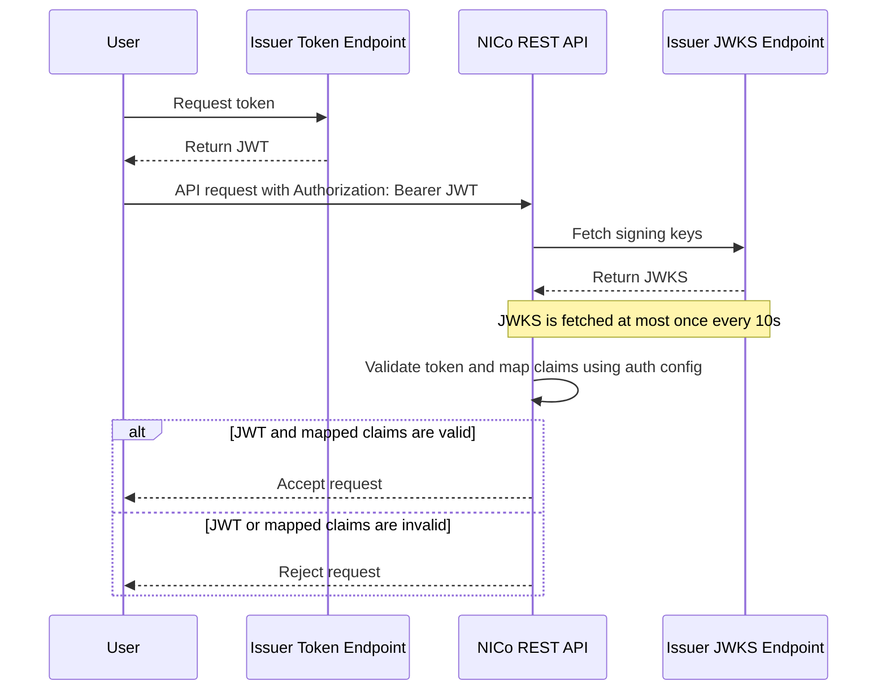

This guide explains how to configure authentication and authorization for the NICo REST API.

### Overview
NICo REST API uses JWT bearer tokens for authentication. For every API request, the service validates the token signature and issuer, then uses configured claim mappings to determine the caller's organization and roles.

Authorization is role based. NICo supports two roles:

- `PROVIDER_ADMIN` can manage provider-owned resources and allocate capacity to tenants.
- `TENANT_ADMIN` can manage tenant-owned resources after the tenant is initialized or receives allocations.

The organization and role that NICo derives from the token determine which API flows are available to the caller. After authentication is configured, API users normally start by retrieving their current Service Account, Infrastructure Provider, or Tenant as described in the [Getting Started](/infra-controller/rest-api-reference/getting-started) section.

The sequence diagram below illustrates the typical authentication and authorization flow when using issuer config.



Additional auth configuration details are documented in [`rest-api/auth/README.md`](https://github.com/NVIDIA/infra-controller/blob/main/rest-api/auth/README.md).

### Choose an Authentication Mode
NICo REST API supports two authentication configuration modes:

- Configure one or more external JWT issuers under `issuers`.
- Configure the built-in Keycloak integration under `keycloak`.

Use only one mode for a deployment. Helm values document `issuers` and `keycloak` as mutually exclusive. When Keycloak is disabled, at least one issuer should be configured.

### Where to Configure Authentication
Authentication is part of the REST API configuration.

For local or direct REST API configuration, update `issuers` or `keycloak` in [`rest-api/api/config.yaml`](https://github.com/NVIDIA/infra-controller/blob/main/rest-api/api/config.yaml):

```yaml
issuers:
  - name: acme-corp-sso
    issuer: "https://auth.example.com"
    jwks: "https://auth.example.com/.well-known/jwks.json"
    audiences: ["nico-api"]
    claimMappings:
      - orgName: "acme-corp-provider"
        orgDisplayName: "ACME Corp Provider"
        roles: ["PROVIDER_ADMIN"]
      - orgName: "acme-corp-tenant"
        orgDisplayName: "ACME Corp Tenant"
        roles: ["TENANT_ADMIN"]
```

For Helm deployments, set the same values under `config` in [`helm/rest/nico-rest/charts/nico-rest-api/values.yaml`](https://github.com/NVIDIA/infra-controller/blob/main/helm/rest/nico-rest/charts/nico-rest-api/values.yaml):

```yaml
config:
  issuers:
    - name: acme-corp-sso
      issuer: "https://auth.example.com"
      jwks: "https://auth.example.com/.well-known/jwks.json"
      audiences: ["nico-api"]
      claimMappings:
        - orgName: "acme-corp-provider"
          orgDisplayName: "ACME Corp Provider"
          roles: ["PROVIDER_ADMIN"]
        - orgName: "acme-corp-tenant"
          orgDisplayName: "ACME Corp Tenant"
          roles: ["TENANT_ADMIN"]
```

For Kustomize deployments, set the same values in the REST API ConfigMap at [`rest-api/deploy/kustomize/base/api/configmap.yaml`](https://github.com/NVIDIA/infra-controller/blob/main/rest-api/deploy/kustomize/base/api/configmap.yaml) under `data.config.yaml`:

```yaml
apiVersion: v1
kind: ConfigMap
metadata:
  name: nico-rest-api-config
data:
  config.yaml: |
    issuers:
      - name: acme-corp-sso
        issuer: "https://auth.example.com"
        jwks: "https://auth.example.com/.well-known/jwks.json"
        audiences: ["nico-api"]
        claimMappings:
          - orgName: "acme-corp-provider"
            orgDisplayName: "ACME Corp Provider"
            roles: ["PROVIDER_ADMIN"]
          - orgName: "acme-corp-tenant"
            orgDisplayName: "ACME Corp Tenant"
            roles: ["TENANT_ADMIN"]
```

After changing a Kubernetes ConfigMap or Helm value, restart or roll out the REST API pods so the service loads the updated configuration.

### Configure an External JWT Issuer
Use `issuers` when tokens are issued by an external identity provider. Each issuer entry tells NICo where to get signing keys, which issuer claim to trust, and how to map token claims to NICo organizations and roles.

```yaml
issuers:
  - name: "my-idp"
    issuer: "https://auth.example.com"
    jwks: "https://auth.example.com/.well-known/jwks.json"
    jwksTimeout: "5s"
    audiences: ["nico-api"]
    scopes: ["openid", "nico"]
    claimMappings:
      - orgName: "acme-corp-provider"
        orgDisplayName: "ACME Corp Provider"
        roles: ["PROVIDER_ADMIN"]
      - orgName: "acme-corp-tenant"
        orgDisplayName: "ACME Corp Tenant"
        roles: ["TENANT_ADMIN"]
```

Key fields:

- `name` is a unique name for this issuer configuration.
- `issuer` must exactly match the token `iss` claim.
- `jwks` is the identity provider's JWKS endpoint.
- `jwksTimeout` controls how long NICo waits when fetching signing keys. If omitted, the default is `5s`.
- `audiences` is optional. If set, the token `aud` claim must contain at least one configured audience.
- `scopes` is optional. If set, the token must contain all configured scopes. NICo checks the `scope`, `scopes`, and `scp` claims.
- `claimMappings` is required and controls the organization and roles assigned to authenticated users.

NICo supports `RS256`, `RS384`, `RS512`, `PS256`, `PS384`, `PS512`, `ES256`, `ES384`, `ES512`, and `EdDSA` signed tokens.

### Claim Mapping Recipes
Claim mappings are the bridge between identity-provider claims and NICo authorization. Choose the mapping style that matches how your IdP represents users, organizations, and roles.

#### Service Account
Use this for machine-to-machine automation. A service account gets both provider and tenant admin roles for the configured organization, which is useful when building a SaaS on top of NICo with its own tenancy layer.

```yaml
claimMappings:
  - orgName: "automation"
    orgDisplayName: "Automation"
    isServiceAccount: true
```

When the REST API is configured in service account mode, API users should first call the [Retrieve Service Account endpoint](/infra-controller/rest-api-reference/api-reference/service-account/get-current-service-account). The service account organization can act as both provider and tenant for common bootstrap and automation workflows.

#### Static Organization and Static Roles
Use this for the simplest onboarding path: every token from the issuer maps to the same NICo organization and fixed roles.

```yaml
claimMappings:
  - orgName: "acme-corp"
    orgDisplayName: "ACME Corp"
    roles: ["TENANT_ADMIN"]
```

#### Static Organization and Dynamic Roles
Use this when every token belongs to the same organization, but the IdP controls each user's roles.

```yaml
claimMappings:
  - orgName: "acme-corp"
    orgDisplayName: "ACME Corp"
    rolesAttribute: "realm_access.roles"
```

The `rolesAttribute` value can use dot notation for nested claims. Roles may be provided as an array, such as `["TENANT_ADMIN"]`, or as a space-separated string, such as `"TENANT_ADMIN PROVIDER_ADMIN"`.

#### Dynamic Organization and Dynamic Roles
Use this for multi-tenant identity providers where organization and role information comes from token claims.

```yaml
claimMappings:
  - orgAttribute: "tenant_id"
    orgDisplayAttribute: "tenant_name"
    rolesAttribute: "nico_roles"
```

With this mapping, the decoded JWT payload should include matching claims:

```json
{
  "iss": "https://auth.example.com",
  "aud": "nico-api",
  "sub": "user-123",
  "tenant_id": "tenant-a",
  "tenant_name": "Tenant A",
  "nico_roles": ["TENANT_ADMIN"]
}
```

All three attributes support dot notation for nested claims. For example, if `orgAttribute` is `tenant.id`, `orgDisplayAttribute` is `tenant.displayName`, and `rolesAttribute` is `nico.roles`, the decoded JWT payload should look like this:

```json
{
  "iss": "https://auth.example.com",
  "aud": "nico-api",
  "sub": "user-123",
  "tenant": {
    "id": "tenant-a",
    "displayName": "Tenant A"
  },
  "nico": {
    "roles": ["TENANT_ADMIN"]
  }
}
```

Dynamic organizations cannot use an organization name already reserved by a static `orgName` mapping.

### Common Configuration Examples
#### SaaS Service Account
Use this when building a SaaS on top of NICo with its own tenancy layer. NICo sees the SaaS backend as one automation identity with both provider and tenant privileges, while the SaaS application manages end-user tenants separately.

```yaml
issuers:
  - name: acme-corp-saas
    issuer: "https://auth.acme-corp.example.com"
    jwks: "https://auth.acme-corp.example.com/.well-known/jwks.json"
    audiences: ["nico-api"]
    claimMappings:
      - orgName: "acme-corp-saas"
        orgDisplayName: "ACME Corp SaaS"
        isServiceAccount: true
```

#### One Business with Provider and Tenant Teams
Use this when one team or group manages infrastructure and another team or group consumes it within the same business. Both teams authenticate through the same issuer, but NICo maps them to separate organizations and roles.

```yaml
issuers:
  - name: acme-corp-sso
    issuer: "https://login.acme-corp.example.com"
    jwks: "https://login.acme-corp.example.com/.well-known/jwks.json"
    audiences: ["nico-api"]
    claimMappings:
      - orgName: "acme-corp-infra"
        orgDisplayName: "ACME Corp Infrastructure Team"
        roles: ["PROVIDER_ADMIN"]
      - orgName: "acme-corp-platform"
        orgDisplayName: "ACME Corp Platform Team"
        roles: ["TENANT_ADMIN"]
```

#### Provider with Multiple Tenant IdPs
Use this when NICo has one provider organization and multiple tenant organizations that authenticate through different identity providers. The provider issuer maps only to `PROVIDER_ADMIN`; each tenant issuer maps only to its own `TENANT_ADMIN` organization.

```yaml
issuers:
  - name: acme-corp-provider
    issuer: "https://login.acme-corp.example.com"
    jwks: "https://login.acme-corp.example.com/.well-known/jwks.json"
    audiences: ["nico-api"]
    claimMappings:
      - orgName: "acme-corp-provider"
        orgDisplayName: "ACME Corp Provider"
        roles: ["PROVIDER_ADMIN"]
  - name: tenant-a
    issuer: "https://login.tenant-a.example.com"
    jwks: "https://login.tenant-a.example.com/.well-known/jwks.json"
    audiences: ["nico-api"]
    claimMappings:
      - orgName: "tenant-a"
        orgDisplayName: "Tenant A"
        roles: ["TENANT_ADMIN"]
  - name: tenant-b
    issuer: "https://login.tenant-b.example.com"
    jwks: "https://login.tenant-b.example.com/.well-known/jwks.json"
    audiences: ["nico-api"]
    claimMappings:
      - orgName: "tenant-b"
        orgDisplayName: "Tenant B"
        roles: ["TENANT_ADMIN"]
```

### Configure Keycloak
Use the `keycloak` section when deploying NICo with the built-in Keycloak integration.

```yaml
keycloak:
  enabled: true
  baseURL: http://keycloak.keycloak.svc.cluster.local:8082
  externalBaseURL: https://auth.nico.example.com
  realm: nico
  clientID: nico-cloud
  clientSecretPath: /var/secrets/keycloak/client-secret
  serviceAccount: true
```

Key fields:

- `enabled` turns on Keycloak integration.
- `baseURL` is the internal URL the REST API uses to reach Keycloak from inside the cluster.
- `externalBaseURL` must match the issuer URL in tokens issued to users.
- `realm` is the Keycloak realm.
- `clientID` is the OAuth client ID.
- `clientSecretPath` is the file path where the client secret is mounted.
- `serviceAccount` enables service account features.

Create the client secret in Kubernetes before enabling Keycloak:

```bash
kubectl create secret generic keycloak-client-secret \
  --namespace nico-rest \
  --from-literal=client-secret="${OAUTH_CLIENT_SECRET}" \
  --dry-run=client -o yaml | kubectl apply -f -
```

For Helm deployments, set `secrets.keycloakClientSecret` if the secret name differs from `keycloak-client-secret`. For Kustomize deployments, ensure the REST API Deployment mounts the secret at the path configured by `keycloak.clientSecretPath`.

If Keycloak is exposed through an ingress, only expose the public endpoints required for authentication and key discovery:

- `/realms/{realm}/protocol/openid-connect/certs`
- `/realms/{realm}/protocol/openid-connect/auth`
- `/realms/{realm}/broker/*/endpoint`

Block administrative and token-exchange paths, including `/admin/*` and `/realms/{realm}/protocol/openid-connect/token`, from external access unless your deployment explicitly requires them.

### Validation Rules
Use these rules when reviewing a configuration before rollout:

- Issuer names must be unique.
- The same issuer URL can only appear once.
- Static `orgName` values must be unique across all issuers.
- Static mappings require `orgDisplayName`.
- Service account mappings are limited to one total in disconnected mode, or one per issuer URL in connected mode.
- Dynamic organization mappings are limited to one across all issuers.
- Dynamic organizations cannot claim statically configured organization names.
- Roles must be `TENANT_ADMIN`, `PROVIDER_ADMIN`, or both.

### Troubleshooting
If requests fail after authentication is enabled, check the token and REST API configuration together.

- `401 Unauthorized` with an audience error usually means the token `aud` claim does not match any configured `audiences`. Update the IdP client audience, update NICo `audiences`, or omit `audiences` if audience enforcement is not needed.
- `403 Forbidden` with a scope error usually means the token is missing one or more configured `scopes`. NICo checks `scope`, `scopes`, and `scp`.
- Invalid token errors often come from an unreachable `jwks` URL, an unsupported signing key, or an `issuer` value that does not exactly match the token `iss` claim.
- Missing authorization usually means the selected `claimMappings` entry did not produce a valid organization and role set. Check `orgName`, `orgAttribute`, `roles`, and `rolesAttribute`.
- For Keycloak, confirm that `externalBaseURL` matches the token issuer and that the client secret is mounted at `clientSecretPath`.

After updating configuration, restart the REST API and inspect pod logs for configuration or token validation errors.
